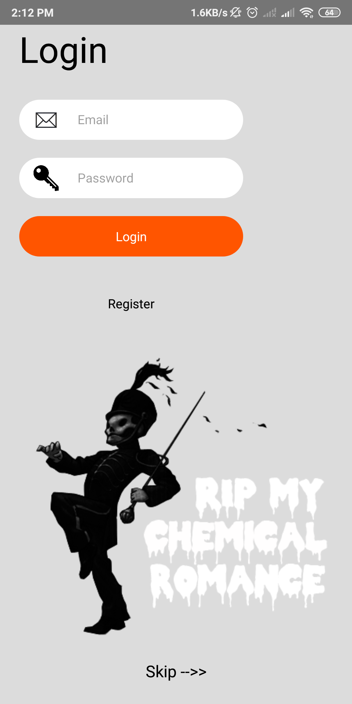
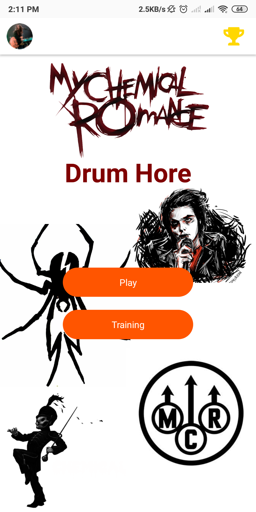
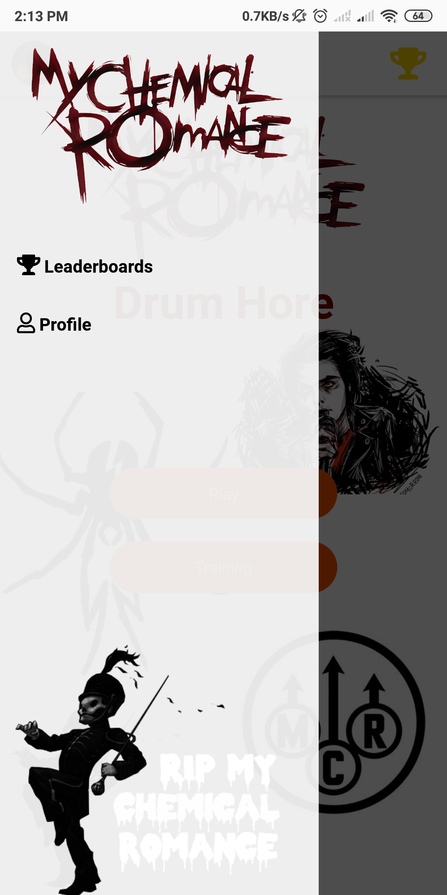
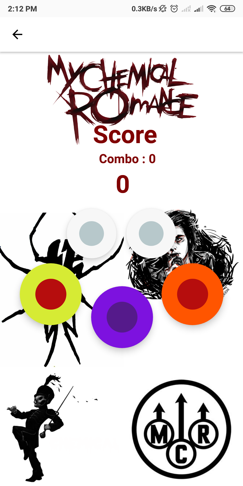
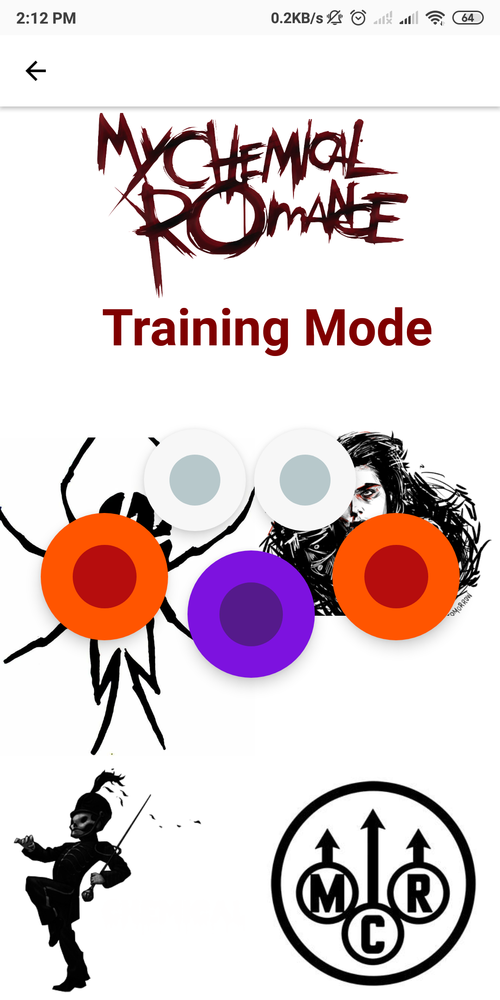
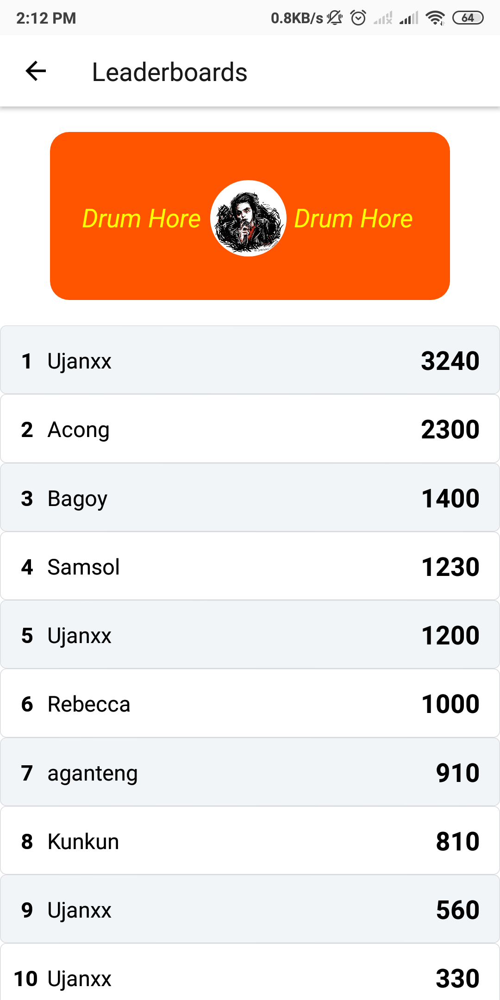

<h1 align="center">Drum Hore</h1>

  
  
  
  

Introduction
=======
### What is Drum Hore?
Drum Hore is a simple virtual drum games that can you can play it when you have free time or when you feel bored

Features
=======
* Arkade Mode ( regular play follow the pattern )
* Training Mode / Free mode

Requirements
=======
* [`npm`](https://www.npmjs.com/get-npm)
* [`react-native`](https://facebook.github.io/react-native/docs/getting-started)
* [`react-native-cli`](https://facebook.github.io/react-native/docs/getting-started)

Usage for Development
=======
1. Open your terminal or command prompt
2. Type `git clone https://github.com/rizkigumilar/DrumHore.git`
3. Open the folder and type `npm install` for install dependencies
4. Type `react-native run-android` for run this app. ***Make sure your device is connected with debugging mode***.

Screenshots and demo application
=======

  
   
  
  
  
  
  
  

